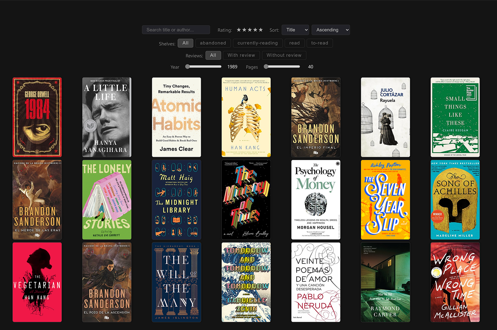

# svelte-bookshelf
A minimalist bookshelf built with SvelteKit and TypeScript

⚠️ Building in public: This bookshef is currently in its initial phase, and what is being published is only its first version, far from the desired result.

Demo: https://juanchiparra.github.io/svelte-bookshelf/



## Features
- Build your digital bookshelf
- Import your data from Goodreads
- Filter by shelf, rating, reviews, year, and pages
- Search by title or author
- Sort by title, author, or rating
- Responsive design for mobile and desktop

### For future upgrade
- Support a native data format (simple JSON/CSV schema)
- Pagination for very large libraries
- Accessibility improvements (clearer navigation, better keyboard support, screen‑reader labels)
- Smarter cover optimization (convert to WebP and generate responsive sizes)

## Project structure
```
svelte-bookshelf/
├── src/
│  ├── lib/
│  │  ├── components/
│  │  │  ├── Filters.svelte
│  │  │  └── Shelf.svelte
│  │  ├── data/
│  │  │  └── books.csv           # your Goodreads export goes here
│  │  ├── styles/
│  │  │  ├── global.css
│  │  │  └── variables.css
│  │  ├── utils/books.ts         # covers, normalization, ISBN helpers
│  │  ├── constants.ts
│  │  ├── types.ts
│  │  └── index.ts
│  ├── routes/
│  │  ├── +page.server.ts        # loads/parses CSV at build time
│  │  └── +page.svelte           # filters, sorts, renders gallery
│  ├── app.html
│  └── app.d.ts
├── static/
│  └── no-cover.svg              # local fallback cover
├── package.json
├── svelte.config.js
├── tsconfig.json
└── vite.config.ts
```

## Getting started
```bash
# Clone this repository
git clone https://github.com/juanchiparra/svelte-bookshelf.git
cd svelte-bookshelf

# Install the dependencies
npm install

# Start the development server
npm run dev
```

### Import your Goodreads CSV
You can export your library from Goodreads and drop it into this project:
1. Go to Goodreads → My Books → Import and export
2. In the Export section, click "Export Library" to download a `.csv`
3. Rename the file to `books.csv`
4. Place it at `src/lib/data/books.csv`

### How cover images are resolved
Cover resolution follows a clear fallback chain to avoid broken images:

1. User‑provided cover
- If your CSV has a `userCover` or `Cover` column:
    - Absolute URLs (http/https/data URIs) are used as is
    - Relative paths are mapped to static assets (`/covers/xyz.jpg`)

2. Open Library (by ISBN)
- If a valid ISBN (10/13) is available, the app builds a URL to `https://covers.openlibrary.org/` using `default=false` so a missing image returns a 404 cleanly

3. Local fallback
-  If neither of the above yields a valid image, a local SVG fallback `no-cover.svg` is used

## Commands
- `npm run dev`
- `npm run build`
- `npm run preview`
- `npm run deploy`

## Contributions
Contributions are welcome! If you encounter a problem or have an idea to improve the project, open an issue or send a pull request.
